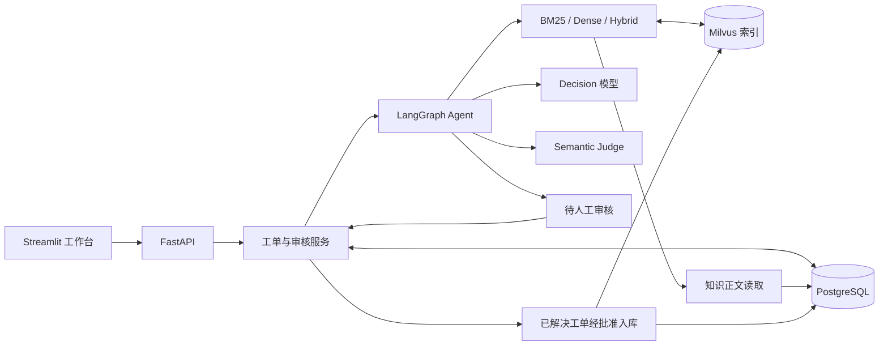

# TicketMind

**基于 RAG 与 Human-in-the-Loop 的 SaaS 技术支持工单 Agent**

TicketMind 是一个可在本地运行的工单处理系统：接收客户问题，检索历史解决记录，由 Agent 生成解决建议、必要追问或转人工提案；人工审核后才发布回复或更新工单状态。已解决工单还可以经审核沉淀为知识，供后续检索复用。

项目面向**合成 SaaS 业务场景与个人工程实践**，包含 FastAPI 服务、Streamlit 工作台、PostgreSQL 持久化、Milvus 检索及模型调用链路。它不是已接入真实客户渠道的线上客服服务。

## 核心功能

| 模块 | 能力 |
| --- | --- |
| 工单与工作台 | 创建工单、查看消息和运行记录、接收客户补充、人工回复及明确关闭 |
| Agent 决策 | 基于当前工单和检索结果，选择继续检索、读取案例详情、提出解决方案、追问或建议转人工 |
| 检索增强 | BM25、Dense 和 Hybrid 检索；Hybrid 通过 RRF 融合排名，检索结果保留来源 ID 与运行审计 |
| 提案与审核 | 结构化输出、独立 Semantic Judge、人工批准/编辑/转人工；所有最终提案先进入待审核状态 |
| 持久化与恢复 | PostgreSQL 工单与审核记录、LangGraph 检查点、幂等写入及版本冲突校验 |
| 知识沉淀 | 人工批准已解决工单入库；PostgreSQL 保存权威正文，Milvus 建立索引，支持重试索引和停用知识 |

**证据使用原则：** Agent 可以在当前客户事实足够时生成不引用历史案例的解决提案（`evidence_ids=[]`）；引用历史案例时，引用 ID 必须来自本次检索。检索命中或提案通过结构校验都不代表内容已由人工确认。

## 系统架构



模型可使用的检索工具仅执行只读操作；发布回复、转人工和关闭工单由业务服务在人工审核后处理。工作台只通过 HTTP API 访问业务功能，不直连数据库或模型。

## 快速启动

下面是 **Windows 本地真实模型模式**的日常启动方式，使用已经准备好的 PostgreSQL、Milvus 和 v2 合成知识库。

### 首次配置

需要 Python 3.12、[uv](https://docs.astral.sh/uv/)、PostgreSQL、Docker / Milvus，以及可用的模型服务凭据。

```powershell
uv sync --locked
if (-not (Test-Path .env)) { Copy-Item env.example .env }
```

在根目录 `.env` 中填写本地 PostgreSQL 连接、`DASHSCOPE_API_KEY`、`DASHSCOPE_WORKSPACE_ID` 和 Milvus 地址；然后执行：

```powershell
uv run --no-sync python scripts/configure_local_auth.py
```

`.env` 仅保存在本地，不提交真实凭据。**v2 数据集需要预先完成 seed、向量缓存导入和索引同步，并确认知识状态为 `active`**；新机器的初始化与缓存缺失处理参见[知识库初始化与同步说明](docs/knowledge-writeback.md#初始化与运维命令)。日常启动不会重复导入知识或生成文档 Embedding。

### 一键启动（v2 + Flash + BM25）

```powershell
.\start_v2_flash.cmd
```

默认启动入口固定本次运行的配置：

| 项目 | 启动值 |
| --- | --- |
| 知识数据集 | 冻结的 `synthetic-v2` |
| Decision 模型 | `qwen3.8-flash` |
| 检索模式 | `bm25` |

Judge 模型、数据库和模型凭据等其余配置仍来自现有 `.env`。这个入口**不会修改** `.env`；如果 PostgreSQL 和 Milvus 都已经在运行，可以使用：

```powershell
.\start_v2_flash.cmd --skip-infra
```

默认启动器可尝试启动项目提供的 Milvus Docker Compose，但 PostgreSQL 必须已运行，或在启动时显式使用现有的 `--postgres-service` / `--postgres-container` 选项。启动完成后访问：

- **工作台：** [http://127.0.0.1:8501](http://127.0.0.1:8501)
- **API 文档：** [http://127.0.0.1:8000/docs](http://127.0.0.1:8000/docs)

终端按 `Ctrl+C` 停止本次启动的 API/UI，保留数据库与 Milvus 数据。创建工单并发起真实模型处理可能产生模型调用费用。

**不调用真实模型的界面演示：** 如果只想查看工单和人工审核流程，在 PostgreSQL 可用的情况下运行 `uv run --no-sync python scripts/start_local.py --demo`。这是带明确标记的隔离替身模式，不用于评价模型效果。

## 使用流程

1. 在工作台创建工单并发起处理，查看模型提案、历史证据和工具调用记录。
2. 人工审核解决建议、追问或转人工提案；可以编辑回复后批准。生成提案本身不会向客户发送消息或关闭工单。
3. 客户补充信息后可以对新消息再次处理；确认解决后，由人工明确关闭工单。
4. 对已解决工单，reviewer 可以检查待入库内容并批准发布到知识库；索引状态为 `active` 后，新工单可以检索到该知识。

当前“发布回复”指保存到系统内部的工单消息；没有接入真实邮件、外部派单或第三方客服平台。

## 测试

```powershell
# 默认单元测试及不依赖真实数据库的测试
uv run --no-sync python -m pytest -q

# 可选：已有隔离测试数据库与 Milvus 可用时执行集成测试
$env:TICKETMIND_RUN_DB_TESTS = '1'
$env:TICKETMIND_RUN_MILVUS_TESTS = '1'
uv run --no-sync python -m pytest -q
Remove-Item Env:TICKETMIND_RUN_DB_TESTS
Remove-Item Env:TICKETMIND_RUN_MILVUS_TESTS
```

仓库提供检索、Agent 决策、人工审核、知识同步等层次的测试及历史验收记录。默认测试与带替身的集成测试不能代替真实模型效果评估；具体实验条件和结果见下方文档。

## 技术栈

**Python 3.12 · FastAPI · Pydantic · LangGraph · PostgreSQL · SQLAlchemy / Alembic · Milvus · Streamlit · pytest**

模型选择通过环境配置完成；本仓库提供的 v2 日常启动入口使用 `qwen3.8-flash` 作为 Decision 模型，Semantic Judge 使用本地配置指定的独立模型。

## 文档

- [架构、业务状态与 API](docs/architecture.md)
- [工作台操作与演示](docs/m5-demo.md)
- [知识存储、入库和索引同步](docs/knowledge-writeback.md)
- [BM25、Hybrid 检索实现与验证](docs/m3-retrieval.md)
- [评测方法与历史结果](docs/m4-evaluation.md)
- [来源、复用与项目贡献](docs/sources-and-contributions.md)
- [历史 README：开发过程、旧配置与阶段验收](docs/README-archive.md)

## 运行范围

项目当前面向本地、单实例、单 Worker 和合成业务数据；保留人工审核，不自动执行客户环境操作。真实客户渠道集成、多实例部署及生产级运维不属于当前交付范围。
