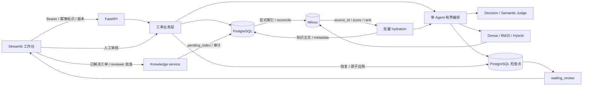

# TicketMind 架构与接口

2026-09-22 核心更新：新增独立人工接管、显式运行恢复、审核最终动作、人工整理知识及独立 BM25 就绪状态。增量与迁移要求见[核心代码修改报告](core-fixes-2026-09-22.md)。

## 请求如何走完

- `workbench` 仅持有当前会话凭据，通过 HTTP 读取和写入，不访问业务数据库或模型。
- `api` 校验身份和输入；`tickets` 管理版本、事务、幂等和状态。
- `agent` 接收最小业务输入 `subject + messages[{role, content}]`，执行检索、有界工具循环、Decision 与独立 Semantic Judge；模型只可选择 `search_cases`、`get_case_detail` 两个只读工具。
- `retrieval` 只从 Milvus 取来源身份和分数，再经 `knowledge` 批量读取 PostgreSQL 正文；JSONL 仅作为 seed/evaluation。生产知识和固定合成版本分别登记集合。
- 持久化 snapshot 只用于审计、恢复与重放；进入 Agent 前投影为最小 `AgentRunInput`，不会把运行元数据直接塞进模型业务输入。
- 模型调用发生在数据库事务外。审核记录不可变，恢复执行后原子写入发布消息、工单状态和已应用标记。
- 一实例一 worker。没有可靠后台队列、多租户或外部邮件发布。

## 两种状态

工单：`open → awaiting_customer / escalated / resolved`。补充客户信息可以使等待客户的工单回到 open；escalated 保持人工接管。

运行：`running → waiting_review → completed`，失败进入 failed，新消息或关闭使旧待审方案 cancelled。completed 表示审核结果已应用，并不表示工单已解决。仅 reviewer 的关闭操作可以设置 resolved。

## 工作台写入约束

表单以用户当前查看的快照版本为准，页面重跑不自动替换 expected_version。所有写入先生成待确认请求，固定请求体和幂等标识，用户确认后才发送。网络失败不自动重发。刷新工单可查看最新状态，409 提示重新核对。

`GET /auth/me` 从服务端返回 actor_id、role 和 live/synthetic_demo 模式，不返回凭据。退出登录清空会话；凭据不进入 URL、磁盘或共享缓存。工作台的 API 地址由启动环境变量 `TICKETMIND_API_URL` 配置，不允许用户输入任意目标转发凭据。

`ReviewRead.idempotency_key` 用于恢复已保存而未应用的审核。重试仍要求原审核人、原请求体和原 key；后端权限、版本和检查点校验保持生效。浏览器刷新丢失会话内尚无响应的请求时，先查工单/运行，不直接重新创建运行。

## API 索引

所有业务接口使用 Bearer；所有 POST 使用 `Idempotency-Key`。字段详见启动后的 `/docs`。

| 接口 | 作用 |
| --- | --- |
| GET /auth/me | 读取可信身份和运行模式 |
| POST /tickets；GET /tickets | 新建、按状态分页读取工单 |
| GET /tickets/{id} | 消息、版本和最新运行 |
| POST /tickets/{id}/messages | 客户补充，或 reviewer 人工回复 |
| POST /tickets/{id}/runs | 从数据库最新客户消息触发处理 |
| GET /tickets/{id}/runs；GET /tickets/{id}/runs/{run} | 运行历史、提案、引用、工具、usage、错误和审核 |
| POST /tickets/{id}/runs/{run}/review | reviewer 批准、编辑或改为转人工 |
| POST /tickets/{id}/close | reviewer 明确确认解决 |
| POST /tickets/{id}/escalate | reviewer 独立人工接管，不要求 Agent 已生成提案 |
| POST /tickets/{id}/runs/{run}/recover | reviewer 从检查点恢复已结束请求，不调用模型或发布回复 |
| GET /sources/{id}?corpus_version=... | 对应版本合成来源，版本不可用则保留运行快照供查看 |
| GET /tickets/{id}/knowledge | 已解决工单候选全文或知识状态 |
| POST /tickets/{id}/knowledge/approve | reviewer 显式批准，expected_version 绑定工单 |
| GET /knowledge/{dataset}/{source} | 内容、审核、索引状态与失败码 |
| POST /knowledge/{dataset}/{source}/retry 或 /retire | reviewer，expected_version 绑定知识状态 |

错误返回 error_code、message、request_id。401 身份无效；403 权限不足；409 版本、状态或幂等冲突；422 输入无效。HTTP 201 后仍需看 run_status；页面明确展示 failed。

知识由人工整理正文后批准，原始会话保留审计。批准先提交 PG，BM25 正文索引强一致读回成功后可 active，Dense 就绪状态独立记录；缺向量不阻止 BM25 发布或通过 Hybrid 的关键词通道召回。检索过滤 inactive、missing、hash 不一致及 Dense 未就绪来源，保留诊断。知识正文发布后仍不可原地编辑。新表字段和操作见[核心代码修改报告](core-fixes-2026-09-22.md)，历史实现见[知识交付报告](knowledge-writeback.md)。
