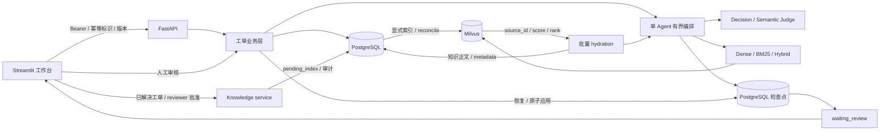

# TicketMind 架构与接口

2026-09-22 核心更新：新增独立人工接管、显式运行恢复、审核最终动作、人工整理知识及独立 BM25 就绪状态。增量与迁移要求见[核心代码修改报告](core-fixes-2026-09-22.md)。

## 请求如何走完

2026-10-06 durable 重构：生产图将 retrieve、decision、两种只读工具、judge、最多一次 final-only repair 和 review 共挂 PostgreSQL checkpointer（sync）。计算恢复为短认领事务 → 释放业务连接 → reviewer 授权的图续算 → 短事务重检版本/status/active 并保存待审核结果。启动仅分类；fatal、配置漂移、非法/缺失 checkpoint 与预算耗尽禁止续算。已观察失败耗时保留，人工等待/离线不计时；未知硬退出的单模型调用（Decision/Judge/Repair）按冻结 effective timeout=min(30 秒, 原剩余预算)保守扣减，账本明确标记 conservative/estimated，与 observed 分开累计；扣后耗尽先持久化终止标记，再保存预算耗尽失败，不执行能力。冻结上限缺失或未知复合 retrieve/search/detail 调用无法可靠确定上限时拒绝。恢复扣减 prepared 先持久化，唯一 resume_gate 再持久化 started 后路由原未完成节点；prepared 崩溃复用扣减，started 后再次硬退出创建新的估算 attempt。started 表示已允许进入调用阶段，不证明供应商实际收到请求，因此仍属保守估算。已 checkpoint 节点跳过，未完成节点可能重复；失败 attempt usage 独立记录，不叠加逻辑成功 usage。旧审核 checkpoint 仅恢复已有 output/审核，旧 compute 不升级。Phase 6 已移除旧 inner graph、compute 黑盒节点和 bounded_decision/finish_proposal 的 Python while；ReviewWorkflow 在初始化只编译一次，runner 与失败异常 sink 通过 LangGraph invocation context 注入。AgentRunner 直接调用同一拓扑到 Judge 通过后 END（无 saver），业务执行仍经 review interrupt（PostgresSaver、sync）。旧 callable 测试/演示适配器在 retrieve 入口接入已计算结果，不具备计算续算能力；同名 review/output 保留旧审核 checkpoint 兼容。

```mermaid
flowchart LR
  UI[Streamlit 工作台] -->|Bearer / 幂等标识 / 版本| API[FastAPI]
  API --> B[工单业务层]
  B --> PG[(PostgreSQL)]
  B --> AG[单 Agent 有界编排]
  AG --> M[Decision / Semantic Judge]
  AG --> R[Dense / BM25 / Hybrid]
  R --> MV[(Milvus)]
  MV -->|source_id / score / rank| HY[批量 hydration]
  HY -->|知识正文 / metadata| PG
  HY --> AG
  AG --> CP[(PostgreSQL 检查点)]
  CP --> WAIT[waiting_review]
  WAIT --> UI
  UI -->|人工审核| B
  B -->|恢复 / 原子应用| CP
  UI -->|已解决工单 / reviewer 批准| K[Knowledge service]
  K -->|pending_index / 审计| PG
  PG -->|显式索引 / reconcile| MV
```

- `workbench` 仅持有当前会话凭据，通过 HTTP 读取和写入，不访问业务数据库或模型。
- `api` 校验身份和输入；`tickets` 管理版本、事务、幂等和状态。
- `agent` 接收最小业务输入 `subject + messages[{role, content}]`，执行检索、有界工具循环、Decision 与独立 Semantic Judge；模型只可选择 `search_cases`、`search_docs` 两个只读工具。
- `retrieval` 只从 Milvus 取来源身份和分数，再经 `knowledge` 批量读取 PostgreSQL 正文；JSONL 仅作为 seed/evaluation。生产知识和固定合成版本分别登记集合。
- 持久化 snapshot 只用于审计、恢复与重放；进入 Agent 前投影为最小 `AgentRunInput`，不会把运行元数据直接塞进模型业务输入。
- 模型调用发生在数据库事务外。审核记录不可变，恢复执行后原子写入发布消息、工单状态和已应用标记。
- 一实例一 worker。没有可靠后台队列、多租户或外部邮件发布。

## 两种状态

工单：`open → awaiting_customer / escalated / resolved`。补充客户信息可以使等待客户的工单回到 open；escalated 保持人工接管。

运行：`running → waiting_review → completed`，失败进入 failed，新消息或关闭使旧待审方案 cancelled。completed 表示审核结果已应用，并不表示工单已解决。仅 reviewer 的关闭操作可以设置 resolved。

## 工作台写入约束

表单以用户当前查看的快照版本为准，页面重跑不自动替换 expected_version。所有写入先生成待确认请求，固定请求体和幂等标识，用户确认后才发送。网络失败不自动重发。刷新工单可查看最新状态，409 提示重新核对。

`GET /auth/me` 从服务端返回 actor_id、role 和 live/synthetic_demo 模式，不返回凭据。退出登录清空会话；凭据不进入 URL、磁盘或共享缓存。工作台的 API 地址由启动环境变量 `TICKETMIND_API_URL` 配置，不允许用户输入任意目标转发凭据。

`ReviewRead.idempotency_key` 用于恢复已保存而未应用的审核。重试仍要求原审核人、原请求体和原 key；后端权限、版本和检查点校验保持生效。浏览器刷新丢失会话内尚无响应的请求时，先查工单/运行，不直接重新创建运行。

## API 索引

所有业务接口使用 Bearer；所有 POST 使用 `Idempotency-Key`。字段详见启动后的 `/docs`。

| 接口 | 作用 |
| --- | --- |
| GET /auth/me | 读取可信身份和运行模式 |
| POST /tickets；GET /tickets | 新建、按状态分页读取工单 |
| GET /tickets/{id} | 消息、版本和最新运行 |
| POST /tickets/{id}/messages | 客户补充，或 reviewer 人工回复 |
| POST /tickets/{id}/runs | 从数据库最新客户消息触发处理 |
| GET /tickets/{id}/runs；GET /tickets/{id}/runs/{run} | 运行历史、提案、引用、工具、usage、错误和审核 |
| POST /tickets/{id}/runs/{run}/review | reviewer 批准、编辑或改为转人工 |
| POST /tickets/{id}/close | reviewer 明确确认解决 |
| POST /tickets/{id}/escalate | reviewer 独立人工接管，不要求 Agent 已生成提案 |
| POST /tickets/{id}/runs/{run}/recover | reviewer 显式恢复检查点；计算续算可能调用模型，已有提案/审核重放不调用模型，恢复不发布回复 |
| POST /tickets/{id}/runs/{run}/cancel | reviewer 终止请求已结束的遗留 running 运行，保存原因与审计；不读检查点、不调用模型 |
| GET /sources/{id}?corpus_version=... | 对应版本合成来源，版本不可用则保留运行快照供查看 |
| GET /tickets/{id}/knowledge | 已解决工单候选全文或知识状态 |
| POST /tickets/{id}/knowledge/approve | reviewer 显式批准，expected_version 绑定工单 |
| GET /knowledge/{dataset}/{source} | 内容、审核、索引状态与失败码 |
| POST /knowledge/{dataset}/{source}/retry 或 /retire | reviewer，expected_version 绑定知识状态 |

错误返回 error_code、message、request_id。401 身份无效；403 权限不足；409 版本、状态或幂等冲突；422 输入无效。HTTP 201 后仍需看 run_status；页面明确展示 failed。

检索硬退出、检查点损坏或冻结配置无法核对导致恢复被拒绝时，reviewer 可在运行记录填写原因并选择“终止中断运行”，确认后再人工回复、接管或关闭。cancel 请求包含 `expected_version` 与 `reason`（最多 7900 字符），使用 `Idempotency-Key`；服务端通过同一单实例执行保护器拒绝终止活跃计算、审核和恢复。运行变为 cancelled，系统审计消息与工单版本递增在同一事务提交，原检查点、提案和审核保留。旧运行不能再恢复或审核；如需重新自动处理，先追加客户消息，使用新版本和最新客户消息创建新运行。

知识由人工整理正文后批准，原始会话保留审计。批准先提交 PG，BM25 正文索引强一致读回成功后可 active，Dense 就绪状态独立记录；缺向量不阻止 BM25 发布或通过 Hybrid 的关键词通道召回。检索过滤 inactive、missing、hash 不一致及 Dense 未就绪来源，保留诊断。知识正文发布后仍不可原地编辑。新表字段和操作见[核心代码修改报告](core-fixes-2026-09-22.md)，历史实现见[知识交付报告](knowledge-writeback.md)。

## Tool / Docs 执行与恢复

当前单图入口为 `bootstrap_retrieve`，随后 `decision` 路由到 `search_cases` / `search_docs` 或 `judge`。每个工具成功或业务拒绝后都回到 Decision；首次 Judge 拒绝进入唯一 final-only Repair，再次拒绝安全失败。共享 step 耗尽时使用代码生成的固定转人工提案直接进入 review，不调用 Judge；active time 耗尽保持失败。

若首次 Judge FAIL 后已无 step 执行 Repair，该节点改为程序固定转人工，清除 `candidate_proposal` / `judge_result` / `guardrail_feedback`，不增加 `repair_attempt`，不调用 Repair 模型或第二 Judge。此固定提案从 repair 直接进入 review（standalone 为 END）。恢复已达 step 上限的 Decision/Repair 时识别为纯代码步骤，不创建未知模型耗时估算；原累计活跃时间仍生效。

Cases/Docs 保留独立检索配额、去重 query 与正文证据，首次检索计 Case1 / step1。Docs BM25 不初始化 embedding；hybrid 明确跳过未就绪 dense。Decision 与 Judge 都接收本次实际 Cases/Docs 正文；来源校验覆盖两种来源。业务审核运行保存 Docs chunk 快照，工作台直接展示，不向 Case `/sources` API 请求 Docs 来源。

新 state_version=2，Decision/Judge protocol=v3；metadata 与 recovery contract 冻结 Docs 版本、状态、catalog_hash、collection、检索模式及额度。显式恢复先检查版本、审计/计数/来源不变量和配置漂移，再执行未完成节点。旧 compute 状态与旧 retrieve 节点拒绝升级；历史等待审核只读取原 output，审核恢复与重放仍不调用模型。成功逻辑步骤与工具审计不会重复，失败 attempt 用量和 observed/estimated 时间仍单独保留。

Docs 集合名为 `docs_bm25_<manifest hash>`，与 Cases 分离；`docs:<doc_id>:<section>:<chunk>` 来源只由 Docs PostgreSQL 表 hydration。导入文件的标准化 hash、标题/章节/正文 chunk hash 与索引读回 hash 用于过滤旧结果；文档版本和 catalog_hash 变化会使旧计算契约漂移。Docs 集合版本/schema/analyzer/index 或返回协议不一致属于 terminal failure，临时连接失败保持可恢复。新增迁移 `e4ad82c7f321` 创建三张文档表。

LangSmith 默认关闭，缺 key 不发送。自定义能力事件经 256 项有界队列异步发送，单次 SDK HTTP timeout 为 1000 ms，队列压力或 SDK 故障会丢弃追踪而不改变业务。业务 ID/thread/attempt/checkpoint 关联跨恢复事件，追踪对象不进入 durable state 或冻结契约。完整命令、最终测试结果与实连限制见[本次交付报告](tool-docs-refactor-verification.md)；先前 durable 阶段记录仍见[历史重构报告](agent-durable-refactor.md)。
